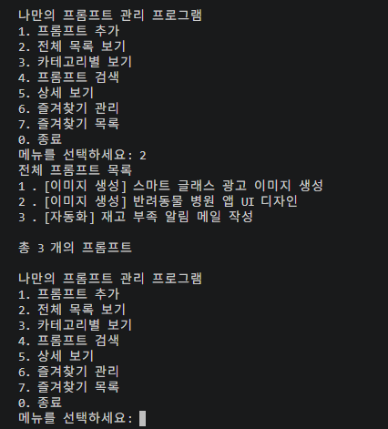
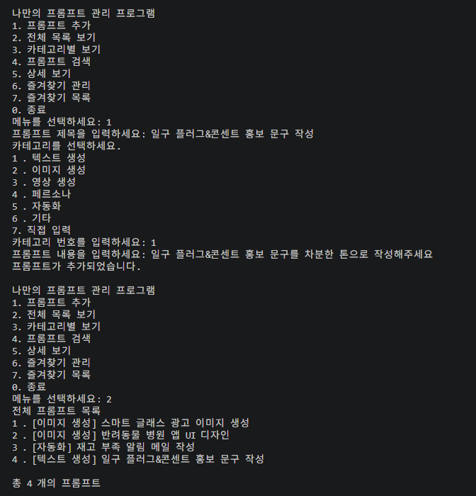
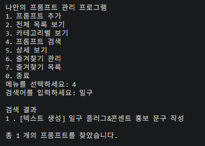
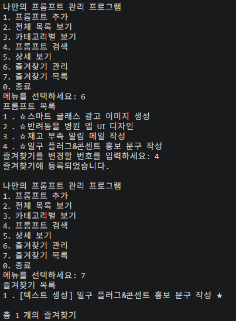
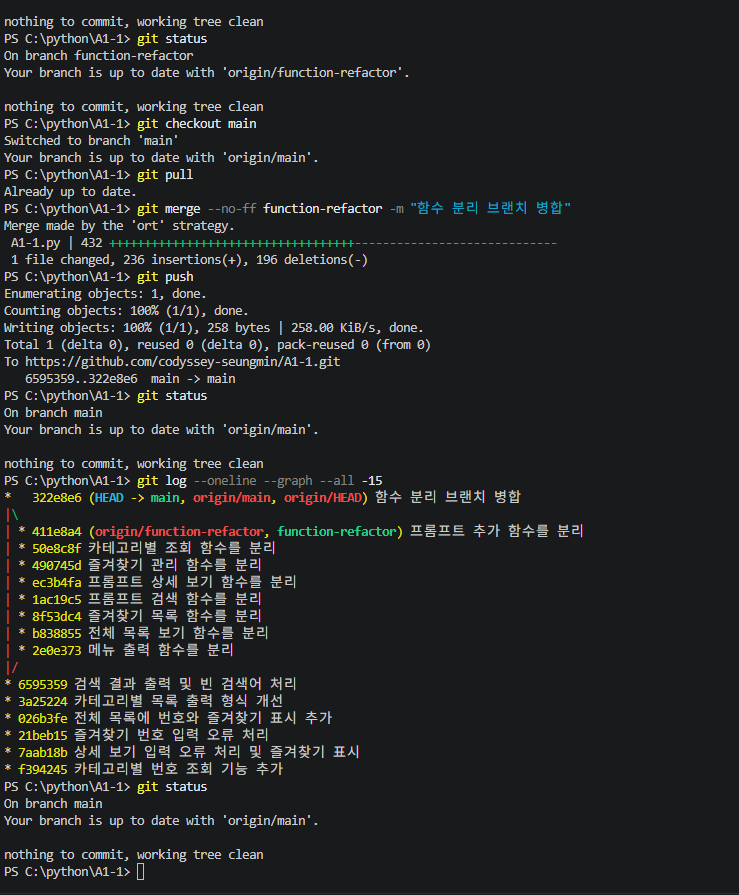
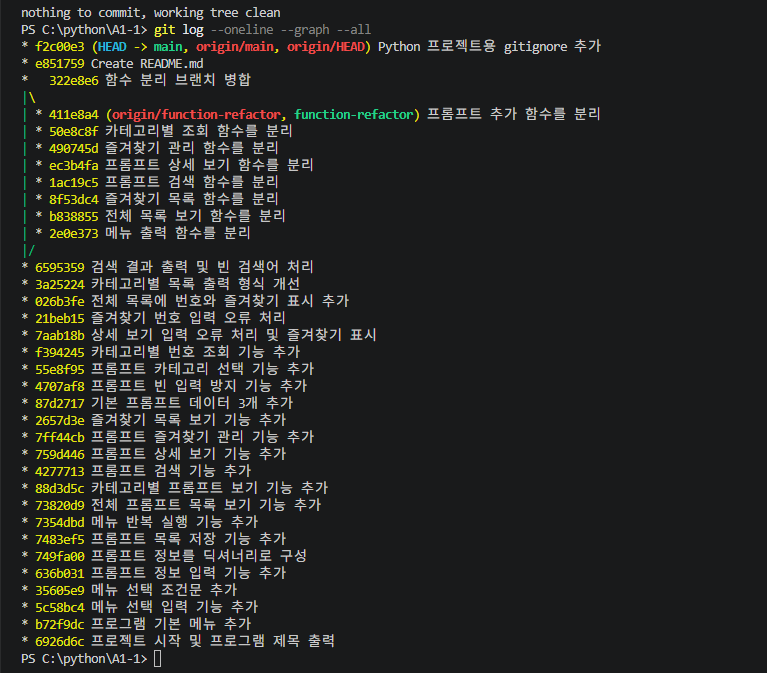
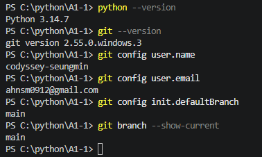
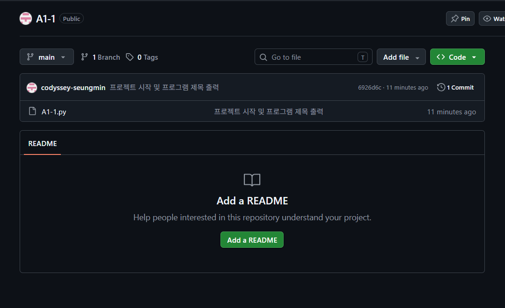
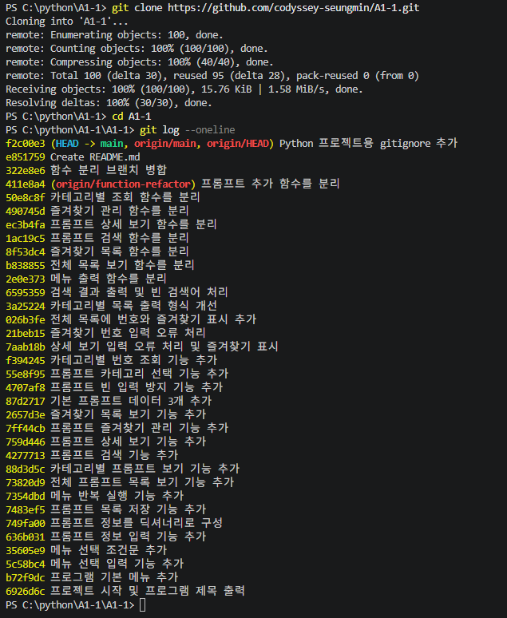

# 콘솔 기반 프롬프트 관리 프로그램

Python 기초 문법과 Git 버전 관리를 학습하기 위해 만든 콘솔 기반 프롬프트 관리 프로그램입니다.

이전 AI 활용 미션에서 작성한 프롬프트를 기본 데이터로 등록하고, 새로운 프롬프트를 추가하거나 카테고리별로 조회할 수 있습니다. 검색, 상세 보기, 즐겨찾기 관리 기능도 제공합니다.

프로그램 실행 중 추가한 프롬프트와 즐겨찾기 상태는 유지되며, 프로그램을 종료하면 초기화됩니다.

## 개발 환경

* Python 3.10 이상
* Visual Studio Code
* Git
* 외부 라이브러리 사용 없음

## 실행 방법

1. 저장소를 복제합니다.

```bash
git clone https://github.com/codyssey-seungmin/A1-1.git
```

2. 프로젝트 폴더로 이동합니다.

```bash
cd A1-1
```

3. 프로그램을 실행합니다.

```bash
python A1-1.py
```

Windows 환경에서 `python` 명령어가 작동하지 않으면 다음 명령어를 사용할 수 있습니다.

```bash
py A1-1.py
```

## 주요 기능

1. **프롬프트 추가**

   * 제목, 카테고리, 내용을 입력하여 새로운 프롬프트를 등록합니다.
   * 빈 입력값은 다시 입력하도록 처리합니다.
   * 카테고리는 기본 목록에서 선택하거나 직접 입력할 수 있습니다.

2. **전체 목록 보기**

   * 저장된 프롬프트의 번호, 카테고리, 제목, 즐겨찾기 여부를 표시합니다.

3. **카테고리별 보기**

   * 선택한 카테고리에 해당하는 프롬프트만 모아서 표시합니다.

4. **프롬프트 검색**

   * 제목 또는 내용에 포함된 키워드로 프롬프트를 검색합니다.
   * 영문은 대문자와 소문자를 구분하지 않고 검색합니다.

5. **상세 보기**

   * 프롬프트 번호를 선택하여 제목, 카테고리, 즐겨찾기 상태와 전체 내용을 확인합니다.

6. **즐겨찾기 관리**

   * 프롬프트 번호를 선택하여 즐겨찾기를 등록하거나 해제합니다.

7. **즐겨찾기 목록**

   * 즐겨찾기로 등록한 프롬프트만 모아서 표시합니다.

8. **종료**

   * 프로그램을 종료합니다.

## 프로그램 실행 화면

### 메뉴 및 전체 프롬프트 목록

프로그램을 실행하면 번호로 기능을 선택할 수 있는 메뉴와 기본 프롬프트가 표시됩니다.



### 프롬프트 추가

제목, 내용, 카테고리를 입력하여 새로운 프롬프트를 등록할 수 있습니다.



### 프롬프트 검색

입력한 키워드가 제목 또는 내용에 포함된 프롬프트를 검색하여 결과를 표시합니다.



### 즐겨찾기 관리

프롬프트를 즐겨찾기에 등록하거나 해제하고, 즐겨찾기된 프롬프트만 모아서 확인할 수 있습니다.



## 프롬프트 카테고리

기본 카테고리는 다음과 같습니다.

* 텍스트 생성
* 이미지 생성
* 영상 생성
* 페르소나
* 자동화
* 기타

프롬프트를 추가하거나 조회할 때 새로운 카테고리를 직접 입력할 수도 있습니다.

## 기본 프롬프트 데이터

프로그램 시작 시 이전 AI 활용 미션에서 작성한 프롬프트 3개가 기본으로 등록되어 있습니다.

* 스마트 글래스 광고 이미지 생성
* 반려동물 병원 앱 UI 디자인
* 재고 부족 알림 메일 작성

## 데이터 구조

프롬프트는 리스트 안에 딕셔너리 형태로 저장합니다.

```python
{
    "title": "프롬프트 제목",
    "category": "이미지 생성",
    "content": "프롬프트 내용",
    "favorite": False
}
```

## 프로그램 구조

모든 코드를 한 곳에 모으지 않고 기능별로 함수를 분리하여 구성했습니다.

* `show_menu()` : 메뉴 출력
* `add_prompt()` : 프롬프트 추가
* `show_list()` : 전체 목록 출력
* `show_by_category()` : 카테고리별 조회
* `search_prompt()` : 프롬프트 검색
* `show_detail()` : 상세 보기
* `manage_favorite()` : 즐겨찾기 등록 및 해제
* `show_favorites()` : 즐겨찾기 목록 출력

## Git 작업 방식

기능 하나를 구현할 때마다 변경 목적을 구분하여 기능 단위로 커밋했습니다.

`function-refactor` 브랜치에서 기능별 함수 분리 작업을 진행한 후, `main` 브랜치에 `--no-ff` 방식으로 병합했습니다.

### 브랜치 병합

`function-refactor` 브랜치의 작업을 `main` 브랜치로 병합하고 GitHub에 push한 결과입니다.



### Git 커밋 기록

`git log --oneline --graph --all` 명령어로 기능 단위 커밋과 브랜치 병합 기록을 확인했습니다.



## 개발 및 저장소 확인

### 개발 환경 확인

Python과 Git 버전, Git 사용자 정보, 기본 브랜치 설정을 확인했습니다.



### GitHub 최초 커밋

프로젝트 파일을 생성하고 첫 번째 커밋과 GitHub push를 완료한 화면입니다.



### 저장소 clone 확인

GitHub에 업로드된 저장소를 별도 폴더에 clone한 후, 전체 파일과 커밋 기록이 정상적으로 내려오는 것을 확인했습니다.


